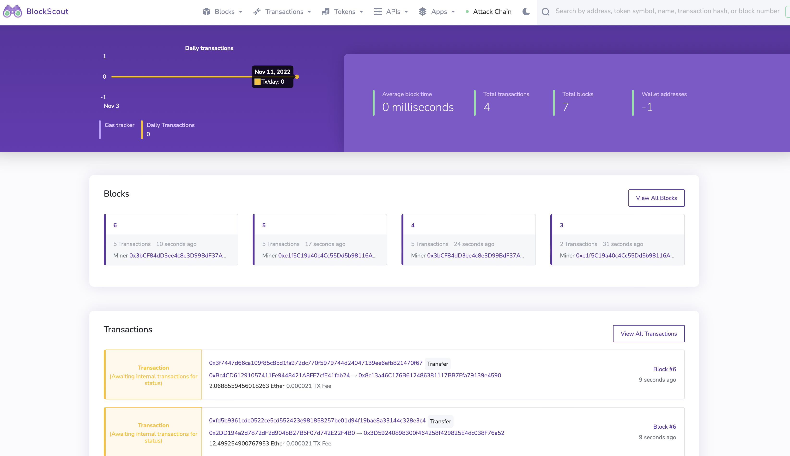

  <h1>Ethereum Attack Simulator</h1>
  <b>Please go to the <a href="https://github.com/mkeleti/docker-eth-attack/wiki">Wiki</a> if you are new to this repository and would like to know more</b>
   
  <a href="#about"><strong>Explore the screenshots »</strong></a>
   
   
  <a href="https://github.com/mkeleti/ethchain-app/issues/new?assignees=&labels=bug&template=01_BUG_REPORT.md&title=bug%3A+">Report a Bug</a>
  ·
  <a href="https://github.com/mkeleti/ethchain-app/issues/new?assignees=&labels=enhancement&template=02_FEATURE_REQUEST.md&title=feat%3A+">Request a Feature</a>
  .
  <a href="https://github.com/mkeleti/ethchain-app/issues/new?assignees=&labels=question&template=04_SUPPORT_QUESTION.md&title=support%3A+">Ask a Question</a>

---

## About

Full stack web application that simulates an attack on the ethereum blockchain.

Read [Majority attack](https://en.bitcoin.it/wiki/Majority_attack) to learn more.

### Built With

Docker, Ethereum Geth Client, Nextjs, and Blockscout

## Getting Started

1. Clone the repo
2. Change your directory to the cloned repo
3. Start the Docker Engine.
4. Run the command `./start.sh`\*

\*If that doesnt work then run `chmod 755 start.sh`

### Prerequisites

- [Docker](https://www.docker.com)
- [yarn](https://yarnpkg.com)

### Installation

If you would like to edit the dashboard make sure to run `yarn install` within the chain dashboard directory.

## Usage

`./start.sh` does everything for you.

As we add more to the Dashboard and connect it more with the blockchain, I will update this section.

## Roadmap

See the [open issues](https://github.com/mkeleti/ethchain-app/issues) for a list of proposed features (and known issues).

- [Top Feature Requests](https://github.com/mkeleti/ethchain-app/issues?q=label%3Aenhancement+is%3Aopen+sort%3Areactions-%2B1-desc) (Add your votes using the 👍 reaction)
- [Top Bugs](https://github.com/mkeleti/ethchain-app/issues?q=is%3Aissue+is%3Aopen+label%3Abug+sort%3Areactions-%2B1-desc) (Add your votes using the 👍 reaction)
- [Newest Bugs](https://github.com/mkeleti/ethchain-app/issues?q=is%3Aopen+is%3Aissue+label%3Abug)

## Support

Reach out to the maintainer at one of the following places:

- [GitHub issues](https://github.com/mkeleti/ethchain-app/issues/new?assignees=&labels=question&template=04_SUPPORT_QUESTION.md&title=support%3A+)
- Contact options listed on [this GitHub profile](https://github.com/mkeleti)

## Project assistance

If you want to say **thank you** or/and support active development of Ethereum Attack Simulator:

- Add a [GitHub Star](https://github.com/mkeleti/ethchain-app) to the project.
- Tweet about the Ethereum Attack Simulator.
- Write interesting articles about the project on [Dev.to](https://dev.to/), [Medium](https://medium.com/) or your personal blog.

Together, we can make Ethereum Attack Simulator **better**!

## Contributing

First off, thanks for taking the time to contribute! Contributions are what make the open-source community such an amazing place to learn, inspire, and create. Any contributions you make will benefit everybody else and are **greatly appreciated**.

Please read [our contribution guidelines](docs/CONTRIBUTING.md), and thank you for being involved!

## Authors & contributors

The original setup of this repository is by [Michael Keleti](https://github.com/mkeleti).

For a full list of all authors and contributors, see [the contributors page](https://github.com/mkeleti/ethchain-app/contributors).

## License

This project is licensed under the **GNU Lesser General Public License**.

See [LICENSE](LICENSE) for more information.

## Acknowledgements

- **[KU Blockchain Institute](https://kublockchain.com)**
- **[Spencer Museum](https://spencerart.ku.edu)**
- **Ethereum**
