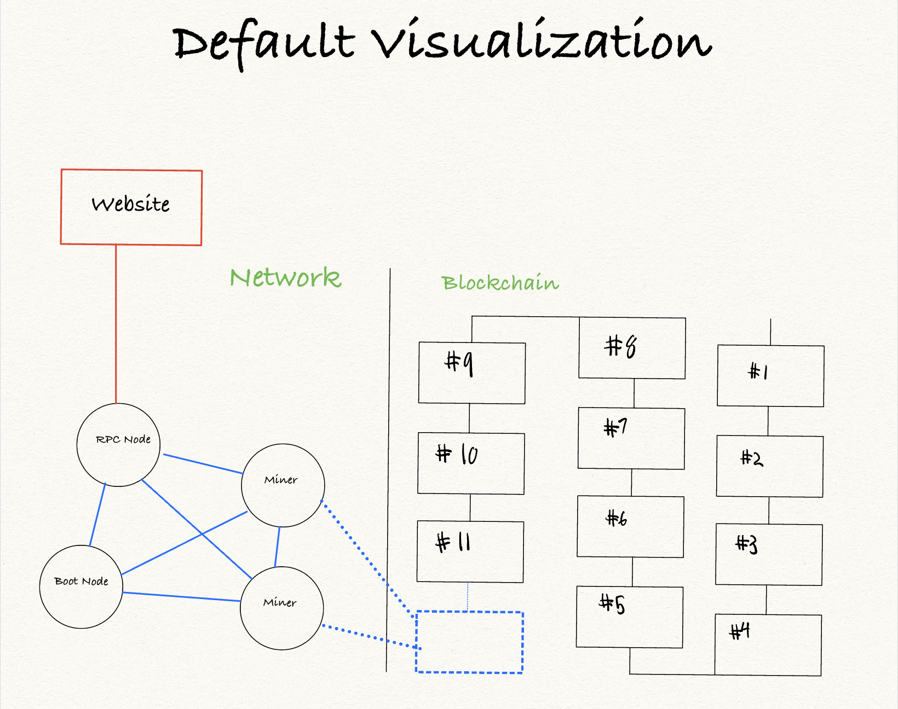
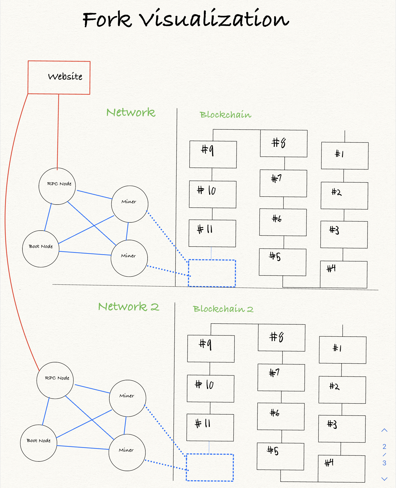

# Blockchain Project Planning

For this project we need to orchestrate a 51% attack which represents taking power away from an entity. 

## Sprints
	
1. Simplify Blockchain to Single Docker Container.
2. Implement 51% Attack
	3. Backup Chain
	4. Execute transactions draining every account in chain
	5. Import new chain which is separated from older chain.
2. Export Data from Blockchain
3. Visualize Blockchain

### Sprint 1 Simplify Blockchain

In order to make the process of creating and updating the blockchain more feasible, it would make sense to compact the blockchain to a single container.

The architecture of our application currently consists of a four containers containing different Geth nodes along with four containers for the dashboard and database. By the end of this sprint we should have one container for all our Geth nodes. Furthermore, we have a pm2 daemon that is currently handling all the transaction calls for our blockchain. This pm2 node exists outside the docker compose when we could easily initiate it from within our blockchain container

There are many advantages to this. The primary benefit would be for when we decide to fork the blockchain, we can greatly simplify the process and optimize our container for the chains that are running.

We will then have a middleman API server that can handle requests between our blockchain and our frontend dashboard. I hope to be able to initiate scripts by simply pressing a button on our frontend dashboard. Making all interactivity of the application happen through the user interface.

———

### Sprint 2 Implement 51% Attack

A 51% attack is when a malicious entity who has over 50% control of the validating nodes in a network decided to implement malicious transactions. We will not be implementing any of the standard actions of a 51% attack, however we will be implementing a hard fork which could only come about with complete control of the miners.

We will be using the DAO fork as an example for this process. You can read more about the DAO attack [**here**](https://www.coindesk.com/learn/2016/06/25/understanding-the-dao-attack/). 

#### Sprint 2.1 Backup Chain

We will backup the entire chain to a binary file, right before we begin simulating an attack on the blockchain. There is an RPC Console available to interact with the chain that we will use for this. The command is`admin.exportChain()` which allows you to specify the location of the chain export.  We will need to make sure this takes place *right* before any attack takes place. [**Here**](https://geth.ethereum.org/docs/rpc/ns-admin) is a list of RPC API calls that can be made.

#### Sprint 2.2 Attack Chain

In the DAO attack the attacker drained the funds from the DAO which was disastrous for the network. We don’t need to go in depth with this aspect of the project and can implement this as a series of RPC calls that send all the funds every account to all the other accounts in the chain. 

At a later point, we can make this more realistic and implement the attack with the flawed DAO contract.

#### Sprint 2.3 Create new Forked Blockchain

Using our newly simplified docker container we should be able to pass in our exported file as an argument. The command should be like this `docker run <geth-container> —import <blockchain backup>`. This will start a new blockchain set at the exact state that we set the backup to. It will be isolated from the other blockchain network within its container.  Since it is on its own separate network it will start building up the chain from the point that we backed up from. Voilà we have forked our blockchain and erased those transactions from our new chain.

#### Sprint 2.4 Merge the chains

This will be tricky but it is doable.

Let’s say we have one blockchain, we then fork the blockchain to a separate but larger blockchain. After about 100 transactions, we can assume that the larger blockchain will have a larger chain than the original blockchain. We then reconnect these networks and merge the two blockchains together. The Blockchain we forked will then be made the canonical chain as a result of being the longest chain.

This will have the effect of **rewriting history**.

[**Here**](https://ethereum.stackexchange.com/questions/2851/how-can-i-reliably-induce-a-blockchain-fork-for-testing-purposes) is a good explanation I found from the Ethereum stack overflow.

## Sprint 3 Export Data from Blockchain:

We will want to add the functionality of exporting blockchain data from the blockchain. Using a python script such as [**ethereum-etl**](https://github.com/blockchain-etl/ethereum-etl) which is available as a docker container. Whether we choose to run it at in a container to populate a backend database or not is up to us. Either way, it will simplify the process of exporting our blockchain to a CSV file for later consumption.

As a general goal, we will want the website to have complete control over these actions in our private network. This will require setting up an api service to interact with our chain. By the end we will ideally have a [**model-view-controller**](https://developer.apple.com/library/archive/documentation/General/Conceptual/CocoaEncyclopedia/Model-View-Controller/Model-View-Controller.html) architecture for our project.

|Model|View|Controller|
|-|-|-|
|Blockchain & Database|Chain Dashboard|REST API|

## Sprint 4 Visualize Blockchain

If we have leftover time, we can work on implementing a visualization for our blockchain. This will help the artists greatly as they formulate what the final exhibition will look like. Here is a general mockup of what I hope the visualization to look like:

Then once the blockchain has been forked, the visualization will update to show two chains:

The third visualization will be a merged blockchain. The two networks will merge which means the number of nodes will increase, however there will only be one blockchain.

*Use these mockups to give yourself a rough idea of how our application currently functions*.
